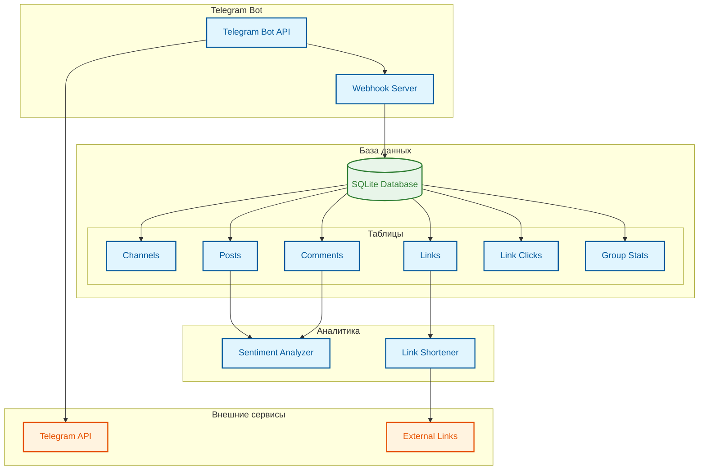

# Инфраструктура проекта

## Основные компоненты

### 1. Telegram Bot
- **Telegram Bot API**: Основной интерфейс взаимодействия с пользователями
- **Webhook Server**: Сервер для обработки входящих webhook-запросов от Telegram

### 2. База данных (SQLite)
- **Channels**: Информация о каналах
- **Posts**: Посты и их метаданные
- **Comments**: Комментарии с оценкой настроения
- **Links**: Ссылки и их сокращения
- **Link Clicks**: Статистика кликов по ссылкам
- **Group Stats**: Статистика групп

### 3. Аналитика
- **Sentiment Analyzer**: Анализ настроения в постах и комментариях
- **Link Shortener**: Сервис сокращения ссылок

### 4. Внешние сервисы
- **Telegram API**: API для взаимодействия с Telegram
- **External Links**: Внешние ссылки и их обработка

## Взаимодействие компонентов

1. Telegram Bot получает команды от пользователей через Telegram API
2. Webhook Server обрабатывает входящие запросы
3. Данные сохраняются в SQLite базе данных
4. Sentiment Analyzer анализирует тексты постов и комментариев
5. Link Shortener обрабатывает ссылки и собирает статистику
6. Вся статистика и аналитика доступна через команды бота 